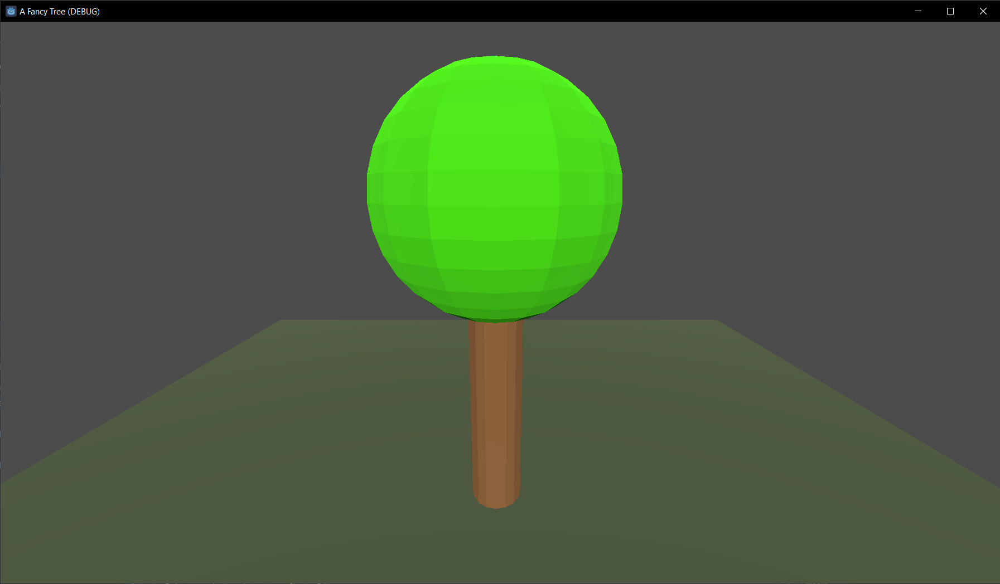

# A Fancy Tree
My personal learning project to make one fancy looking game tree.

I document my progress on my blog, which I created specifically for that purpose:
https://fancytree.hashnode.dev/

This repository will contain a diorama-like short game experience made with the Godot game engine. At some point this will hopefully reach a quality level such that it can serve as a demo for others who strive to learn some aspects of creating high quality graphics in games. 

But at first this will be a humble beginning, as I have much to learn about making stuff look good in games.

# Current State

I managed to create a simple model in Blender and import it into the Godot project. Here's a screenshot from the very first iteration of the fancy tree:

